# Chapter 5 - Mobile Application Analysis at Scale
<p align="center">

	
Author: s3raph
	
[GitHub](https://github.com/s3raph-x00/) | [Website](s3raph.com)
</p>
	
## Overview:

This chapter provides a cursory overview of android application analysis through automated and manual methods followed by a methodology of adjusting to scale.

## Introduction:

Mobile forensics, specifically as it pertains to Android devices, tends to focus a little more heavily on application analysis during the initial evaluation. 
Unlike Windows systems, the sandbox nature of the devices (assuming they aren’t or can’t be easily rooted), makes it a little more difficult gain an initial foothold without first compromising an existing application (such as malicious webpages targeting exploits in Chrome or through hijacking an insecure update process in a given application) or through getting a user to install a malicious application. A given Android phone typically has around 60-100+ applications installed at a given time. This includes system applications maintained by Google, Device applications such as with Huawei or Samsung, and network provider applications such as with Sprint or Verizon. Most of these applications cannot be easily pulled during forensic analysis without utilizing some method of physical extraction (i.e., Use of Qualcomm Debugger functionality).

## Automated Analysis:
	
If during a forensic analysis you are lucky enough to get all of the Android applications resident on the system you are left with the problem of analyzing more than 100+ applications. Most application analysis tools typically are setup to do automated analysis of individual applications. In this space, MobSF (https://github.com/MobSF/Mobile-Security-Framework-MobSF) is considered one of the most popular application analysis tools. This tool does provide a method for dynamically generating an automated analysis of various APKs with varying level of success with both static and dynamic analysis. Installation of this tool is fairly easy and the developers has robust documentation. 

<blockquote>
(Please Refer to: https://mobsf.github.io/docs/#/installation) for the most up to date instructions. The installation instructions following works at the moment: 
</blockquote>
	
```
sudo apt-get install git python3.8 openjdk-8-jdk python3-dev python3-venv python3-pip build-essential libffi-dev libssl-dev libxml2-dev libxslt1-dev libjpeg8-dev zlib1g-dev wkhtmltopdf
git clone https://github.com/MobSF/Mobile-Security-Framework-MobSF.git
cd Mobile-Security-Framework-MobSF
sudo ./setup.sh
```

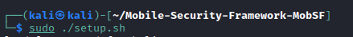

<blockquote>
!!! If you plan on installing this on a VM please note that the dynamic analysis is not really supported and would likely be buggy as it would be virtualizing Android within a virtualized environment. Personally, I use my own virtualized environment separate from MobSF which will potentially be discussed later. !!!
</blockquote>
	
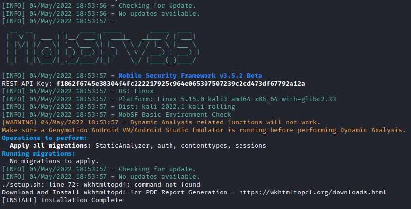

Once installed you can run it with the following simple command within the MobSF directory < Mobile-Security-Framework-MobSF>.

```
./run.sh
```

Additionally, you can specify the listening address and listening port as MobSF starts its own web server for user interaction. The default setting will be used if the command is started without arguments:

```
0.0.0.0:8000
```

Example post run:

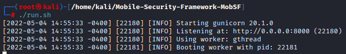

Access to the hosted webpage with your favorite browser shows the following webpage:

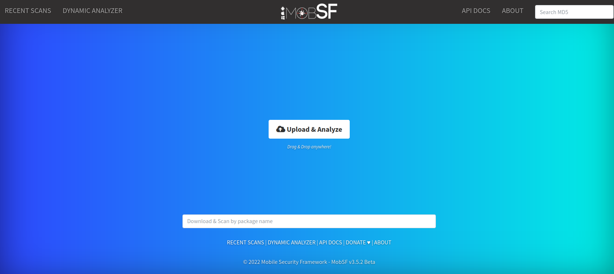

From here you can upload the binary just like Virustotal:


From here most times the webpage will time out so click “Recent Scans” which shows the following:

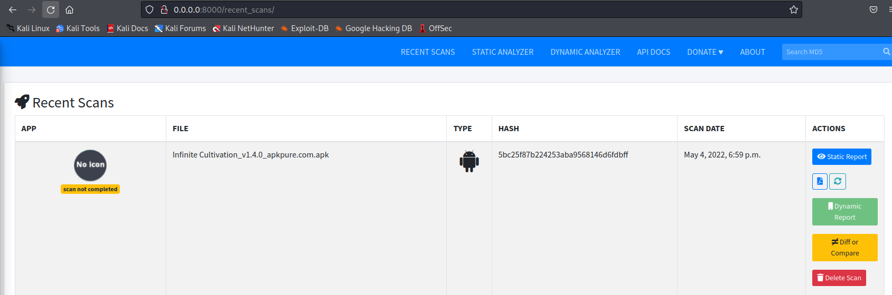

Because we are in a VM, the dynamic report will be unavailable but the static report has the primary details for initial triaging of the application. After a bit and depending on the size of the application, the report will be ready for analysis:

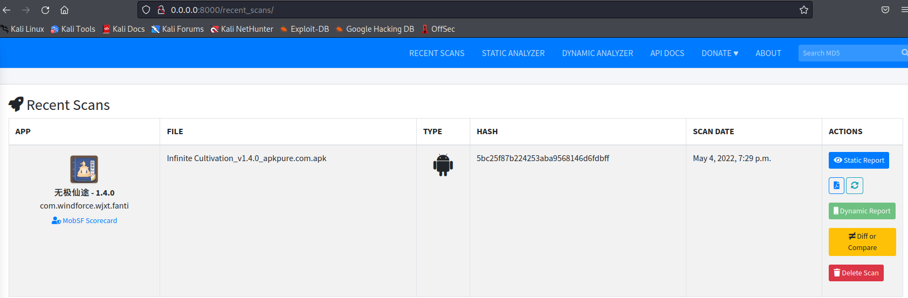

Now for analysis of malware, there are a number of websites hosting samples for analysis but I have typically found vx-underground.org fairly robust. 

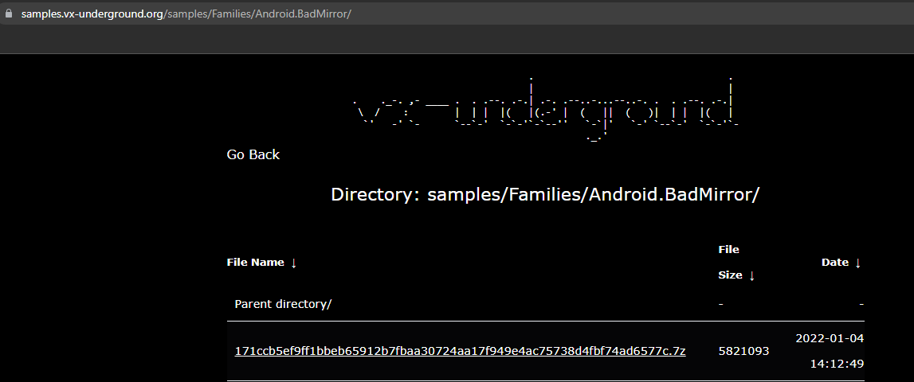

The malware needs to be extracted with the password “infected” and renamed with the extension .apk. The scan by MobSF showed the following details:

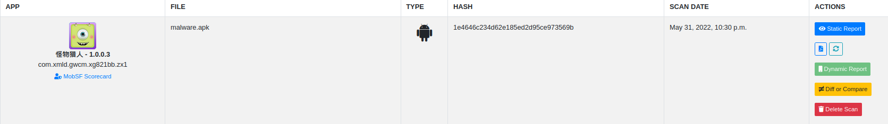

Note that there are two options to view either a Static Report or Dynamic Report. Because we are in a virtual machine, there will not be an available Dynamic report. The Static Report shows the following information:

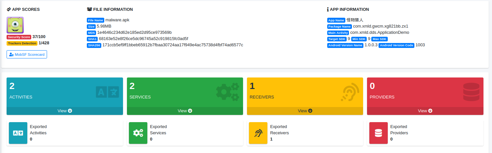

Outside of the calculated hashes, the actual information needed is further down:

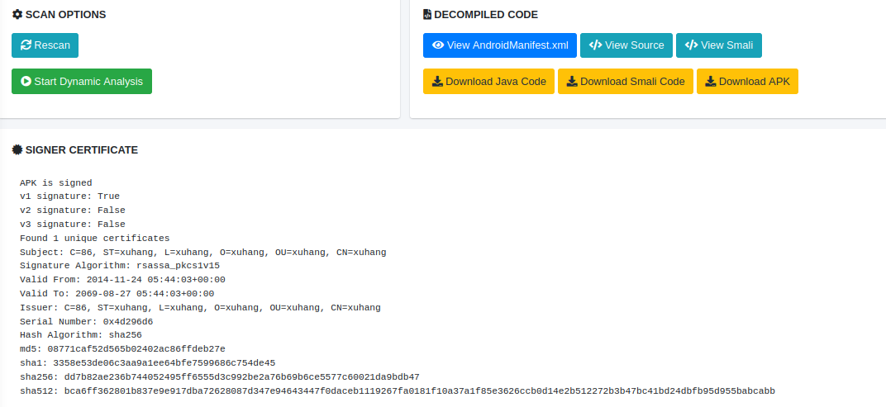

The section in the above right shows that MobSF stored the decompiled Java code that can be referenced later. The section below shows the signing certificate has an unusual xuhang string in almost all of the issuer information. Next section is interest is related to the requested permissions:

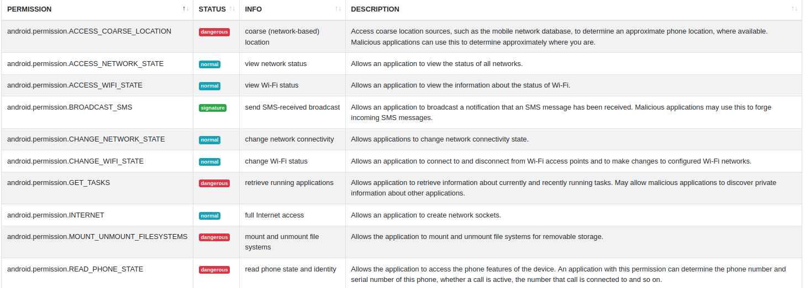

Permissions such as “MOUNT_UNMOUNT_FILESYSTEMS” for what appears to be a game looks incredibly unusual. 

Other sections of interest include various API functions that could potentially indicate capabilities.

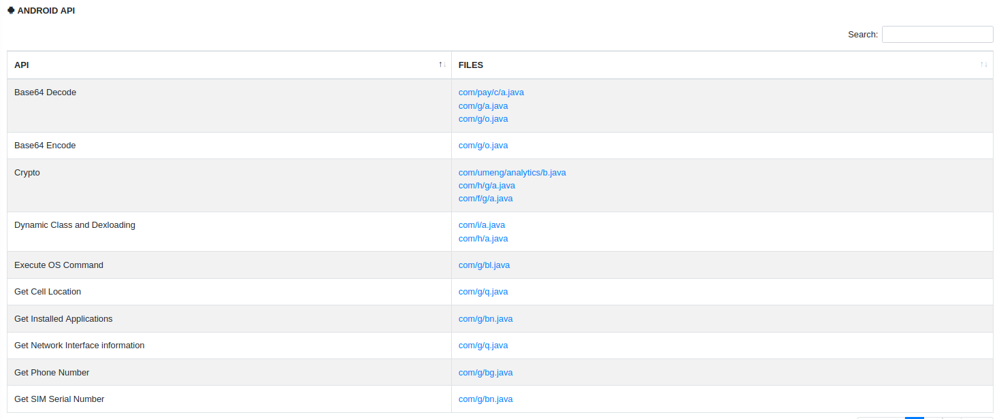

For example, clicking on the “com/g/bl.java” shows the following code segment:


Generally speaking, the function to pass commands to “/system/bin/sh” should be scrutinized and typically is indicative of malicious intent. This isn’t always the case as applications that provide system functionality typically use sh as a means to use native Android OS tools such as ping. 

Another area of concern is the collection and sending of sensitive device information to include the IMSI and wireless MAC address:

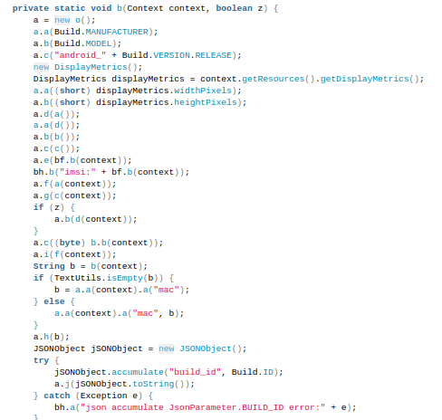

While the functions and information accessed appear malicious, it would be prudent to validate any suppositions with actual evidence of malicious intent. The additional analysis is beyond the scope of this initial writeup but is typical to most malware analysis methodologies. 

## Manual Analysis:

Now that we have done some initial analysis of an APK with an automate tool such as MobSF, let’s dive into doing some manual analysis using JADX (https://github.com/skylot/jadx). JADX is an APK decompiler that converts compiled APKs and DEX files into JAVA source code. The source code for JADX provides both a CLI and GUI based application that runs on Linux, macOS, and Windows. After opening one of the APKs to be compiled within JADX a breakdown of the stored decompiled code, resources, and embedded files can be seen:

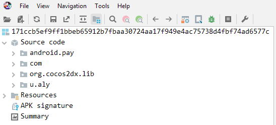

Whether malicious or not, most Android applications have some level of obfuscation. In this case, the major programmatic functionality is not obfuscated but the names of the classes (a, b, c, etc.) do not have significant meaning:

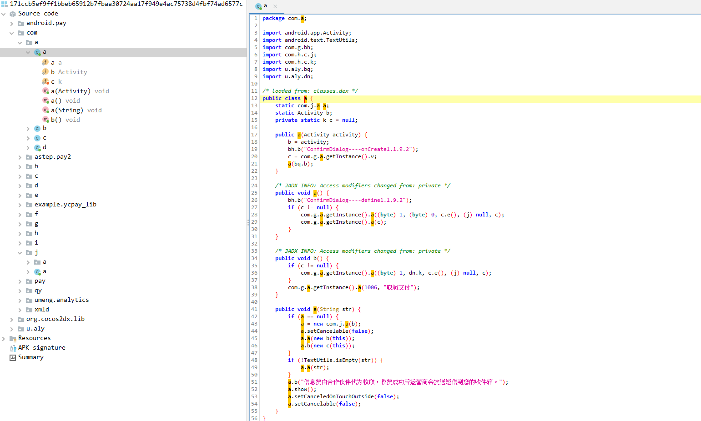

One area that can be manually checked is the APK signature:

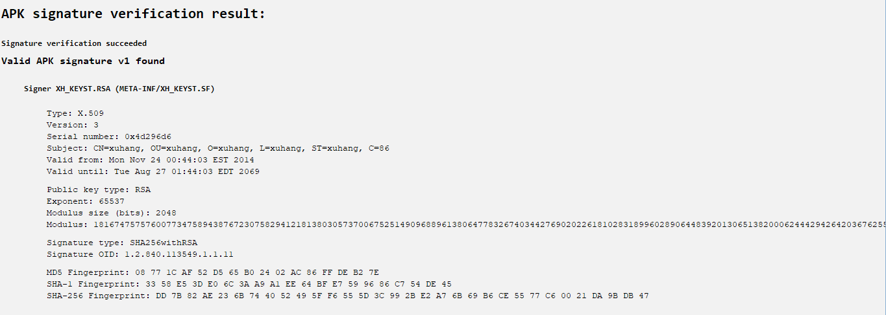

This obviously matched what MobSF had reported.

Another area for manual analysis is the AndroidManifest.XML file stored within the Resources folder structure:


Here we see the same significant number of permissions along with some third-party application app keys which appear toe be directly associated to the following GitHub: https://github.com/angcyo/umeng. Interestingly, the following topic on Alibaba cloud references both the WRITE_EXTERNAL_STORAGE permission as required to dynamically update APKs using UMENG and the associated APPKEY: https://topic.alibabacloud.com/a/use-umeng-to-automatically-update-apk-and-umeng-apk_1_21_32538466.html:

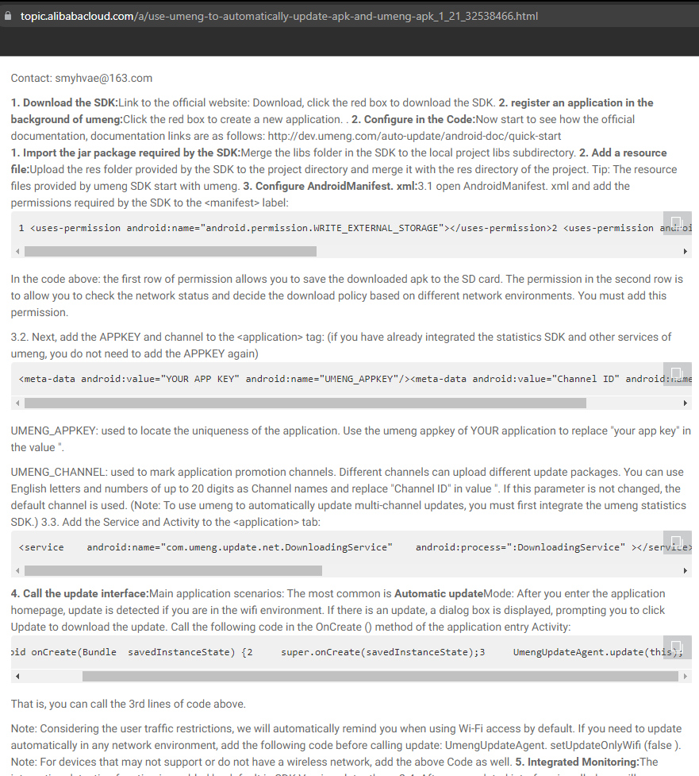

This obviously has the implication, if true, that even if there is not malicious logic baked directly into the application during analysis that it could be manipulated at a later time. Beyond this is out of scope for the write up but this portion of analysis is important to highlight the need for manual analysis and need to read contextual clues.

While usually successful, it should be noted that JADX cannot always decompile the compiled code to JAVA and any errors should be parsed to ensure that the uncompiled code does not have any malicious logic. The following screenshot shows a typical de-compilation error:

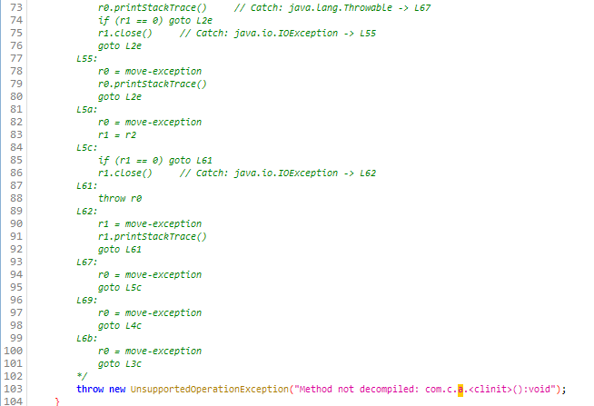

The concept of this writeup was to provide a cursory analysis of a piece of malware that would provide the foundation of automating large scale analysis of APKs. Hard coded references to /system/bin/sh, hard coded IP addresses, and unusual permissions are fairly easy using the built-in search functionality:

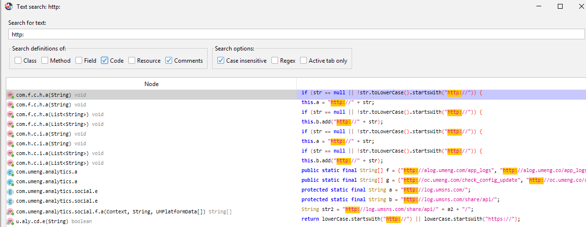

I would recommend enabling searching within comments as sometimes additional functionality using external APIs and websites are simply commented out but otherwise accessible.

## Problem of Scale:

So far, we have covered the bare basics of using MobSF to analyze an APK as well as how to manually interrogate the same APK using JADX. In most malware mobile forensic investigations with physical access (not logical) most stock Android phones have more than 100+ APKs (including system applications, device manufacturer applications, network provider applications, and third-party applications) that could need to be analyzed. Devices in active usage could reach beyond 200+ APKs that could potentially need to be analyzed. 200+ APKs is a significant number of applications for a malware forensic analysis but the investigation could be completed using MobSF and JADX in a few weeks. The problem comes at scale by expanding the number of devices being analyzed. Now you may have 100+ devices, each with 100+ APKs that may or may not be the same version. 
