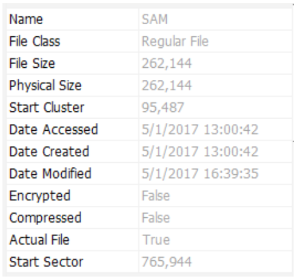

# Chapter 19 - Linux and Digital Forensics

## What is Linux?

There are a plenty of resources available on what Linux is, what role it
fills, and how it compares with other operating systems.  Here we will
discuss Linux from the perspective of digital forensics and incident
response.

There have been many discussions of what defines Linux.  The classical
definition is that Linux is a kernel ("brains of the operating system")
augmented by user space drivers, utilities, and applications that allow
us to interact with a computer in a useful manner.  For the sake of
simplicity we extend the name "Linux" to encompass the entire operating
system, and even the applications that can be bundled and distributed.

Linux was developed by Linus Torvalds at the University of Helsinki back
in the early 1990's.  It was, essentially, a "hobby" version of UNIX
created for PC hardware.

On 25 August, 1991, Torvalds posted this to the Usenet group
comp.os.minix:
> Hello everybody out there using minix
> I'm doing a (free) operating system (just a hobby, won't be big and
> professional like gnu) for 386(486) AT clones.  This has been
> brewing since april, and is starting to get ready. I'd like any
> feedback on things people like/dislike in minix, as my OS resembles
> it somewhat (same physical layout of the file-system (due to
> practical reasons) among other things).
>
> I've currently ported bash(1.08) and gcc(1.40), and
> things seem to work. This implies that I'll get something
> practical within a few months, and I'd like to know what features
> most people would want. Any suggestions are welcome, but I won't
> promise I'll implement them :-)
>
> Linus (torvalds@kruuna.helsinki.fi)
> PS. Yes - it's free of any minix code, and it has a
> multi-threaded fs. It is NOT portable (uses 386 task switching
> etc), and it probably never will support anything other than
> AT-harddisks, as that's all I have :-(.
>        --Linus Torvalds  (quoted from Wikipedia)}

Modern Linux is an operating system very similar to Unix, deriving most of its
functionality from the much older AT&T Unix originally developed in
in the 1970's.  This included a full TCP/IP stack and GNU development tools to
compile programs.  In short, Linux is mostly compliant with the Portable
Operating System Interface for Unix (POSIX).

Despite the warnings of lack of architecture portability and limited
support mentioned by Torvalds in his postscript in the above quote,
Linux has grown to a fully functioning operating system that supports a
multitude of modern hardware.  Standard SATA hard drives through modern
M.2 and NVMe storage are now supported.  Drivers and software support
for newer motherboards and associated hardware are constantly improving
and growing.  The Linux kernel, where most of this support resides, has
a very fast production cycle and support for newer devices (where
specifications are available) is very rapidly added in most cases.

For the digital forensics practitioner, this hardware compatibility
issue can be exceedingly important.  Not only must we verify and _test_
that our hardware is properly supported and functioning as intended; we
also need to ensure that any subject hardware we might need to directly
attach to our system (which we might do for a variety of reasons) is
also properly detected and supported.  This is often done via direct
physical connection, or via boot media on a subject system.
       
While we have given a very general definition of what Linux is and where
it originated, we should also mention what Linux is _not_, particularly
where digital forensics is concerned.  We will cover _why_ you might
want to use Linux for digital forensics in a later section, but for now
a beginner forensics examiner should know that Linux is not a platform
well suited to "point and click", or what some might refer to as
"nintendo forensics" techniques.  While there are graphical user
interface (GUI) tools available for Linux, it is not the strongest OS
for that approach.  More on that later.

Linux can be fairly easy to install, particularly given modern desktop
environments and GUI front ends for configuration and settings.
However, Linux is **NOT** a "better Windows".  Linux should not be
approached as a replacement to Microsoft Windows - one that acts like
Windows and is supposed to be familiar to someone who has been using
Windows (or MacOS for that matter) for years.  Linux works very
differently from some more mainstream operating systems. There is a
steep learning curve and trouble shooting problems can seem overwhelming
to someone used to running Windows on her computer. It is possible to
use Linux as a primary driver for digital forensics, and many digital
forensic practitioners have done this for years. But for most people new
to the field, Linux can be a fantastic learning tool and a great way to
access forensic and operating system utilities on an alternative
platform - but will still remain a secondary operating system.

Now that we have a very basic idea of what Linux is, and what it is not,
let's discuss *why* we might decide to add it to our digital forensic
tool box.

## Why Linux for Digital Forensics

There are any number of reasons for choosing to learn and run Linux for
use as a digital forensics platform.  We will cover the more important
ones here.

### Education

If you are a student of digital forensics, or a practitioner looking to
better understand a particular forensic process, Linux provides an
excellent environment for learning.

Particularly for students, the sheer number of free tools available for
Linux - not to mention the standard operating system utilities - makes
it very much accessible to all levels of income.  No need for expensive
licences or dongles to be able to do a full analysis or participate in
training.  While it is true that many open source digital forensics utilities
will compile and run natively on Windows, the ability to run multiple
copies of Linux, either on physical computers or virtual machines, still
makes it an attractive alternative for learning.

Many of the tools available for digital forensics on Linux are meant to
be used with the command line interface (CLI).  To a beginner it can
certainly appear to be daunting.  But learning at the CLI removes the
clutter of a GUI and all the menus and mouse clicks required to complete
a task.  Most Unix tools adhere to the philosophy that they should do
one thing, and do it well.  As you learn what each tool does and how it
works, you can string them together to accomplish a whole series of
steps with one command using multiple tools all at once.  This approach
allows you to concentrate on the results rather than an interface with
multiple windows and views to sort through. Again this is a benefit for
education specifically. There is no doubt that a forensic software suite
that ingests, analyzes evidence and presents the results in a single
step, is more *efficient*.  But learning from the CLI with specific and
very targeted output can be immensely powerful for students.

### Free(dom)!

Freedom and flexibility are just two of the many attributes that can
help make Linux a useful addition to you tool box.  

First and foremost of course, Linux is free.  As mentioned earlier, this
means we can install it as many times on as many computers (or virtual
machines) as we like.  You can use it as any sort of server while not
tying up valuable budget resources on licensing. This goes for the
forensic software as well.  You can install, copy, and share across
multiple platforms and users, again without breaking the bank.

For a practitioner learning the ins and outs of digital forensics, this
can be very powerful.  You can install multiple copies of Linux across
devices and virtual environments in a simple home lab, deleting,
reinstalling and repurposing computer resources along the way.
Installing and running Linux is a great way to re-purpose old hardware,
which brings us to our next point.

Linux provides unparalleled flexibility.  It will run on all forms of
hardware, from laptop and desktop computers, to mobile devices and
single board computers (SBC). It will run in a variety of virtualisation
environments, up to and including Microsoft Windows own Windows
Subsystem for Linux (WSL/WSL2).  You can chose to run a Linux
distribution on a workstation, on a $50 Raspberry Pi setup, in a virtual
machine, or natively in Windows using WSL.  These all have their
benefits and drawbacks, including cost; direct hardware access;
convenience; and resource requirements.

Another facet of Linux flexibility lies in the number of choices, freely
available, that users have over their working environment.  Desktop
environments like Plasma, Gnome and XFCE provide a wide range of choices
that a user can customize for aesthetics or workflow efficiency.  These
desktop environments don't change the underlying operating system, but
only the way one interacts with the system.  Paired with a separate
*window manager*, there are hundreds of possibilities for customization.
While it may sound trivial, we are not discussing wallpaper and icon
themes here - we are talking about the flexibility to decide exactly
*how* you interact with the system.

For example, you can set up a Linux environment that focuses on
primarily CLI usage where the keyboard is the primary interface and the
mouse is rarely needed.  This can be done with a wide selection of
"tiling" window managers that open new windows in a pre-determined
arrangement and allows for window manipulation, multiple workspaces and
program access all through customizable keystrokes and little or no use
for a mouse.  Certainly not an configuration that will appeal to
everyone, but that is one of the joys of Linux - the ability to
completely customize it to match your particular workflow.

### Control

Another traditional benefit of Linux over other operating systems has
historically been the control in provides over the entire device
environment. This has always been one of the more important factors when
adopting Linux in the context of a forensic workstation.  Most operating
systems are designed to isolate the user from the inner workings of
hardware.  Linux, on the other hand, has traditionally allowed for much
more granular control over attached devices and the associated drivers.
This has blurred somewhat in recent years with a number of popular Linux
versions becoming more desktop oriented and relying more and more on
automation and ease of operation.  While this approach does hide some of
the control options from the user, they are generally still available.

And again, with changes in recent years, this level of hardware control
is not as exclusive to Linux as it once was.  
    
### Cross Verification - An Alternate OS Approach

All of the preceding might come across as pushing Linux as a superior
operating system for digital forensics.  That is most certainly not the
intention. Rather, an effort has been made to point out the strengths of
Linux in comparison to other platforms.  In reality, having Linux in your
digital forensics arsenal is simply having access to a particularly
powerful alternative tool.

It is absolutely possible to utilize Linux as a primary digital forensic
platform in today's laboratory environment. It is also a reality that
providing timely and usable information for non-technical investigators
and managers often means utilizing the reporting and data sharing
functionalities available in modern forensic software suites that most
often run under mainstream operating systems and not Linux.

So where does Linux fit into a modern laboratory where reality and case
load dictates the use of software suites with automated functionality?

As an alternative operating system, Linux is often used to troubleshoot
hardware issues where one platform either cannot detect or cannot access
particular media.  Linux is well known for its ability to provide better
diagnostic information and sometimes better detection for damaged or
otherwise misbehaving devices.  When dealing with difficulties accessing
a hard drive, for example, you will often hear the advice "connect it to
a Linux box". Being able to directly monitor the kernel buffer and view
the interactions between hardware and the kernel can be a great help in
solving hardware issues.

There is also the benefit of having a completely different operating
system utilizing a different tool set to do cross verification of
findings.  In some organizations, the cross verification of significant
analysis results is a requirement.  Depending on the situation, it can
make good sense even if not explicitly required.  Cross verification
means that if a practitioner finds an artifact or draws a particular
conclusion on a given piece of evidence then there needs to be a
"confirmation" of that finding using a different tool or technique.
Consider the following simplified example:

1. A forensic examiner extracts the "user created contents" (documents,
   emails, etc.) from computer media and provides the data to an
   investigator using a common Windows forensic software suite.
2. The investigator identifies a particular document that can be
   considered valuable to the case being investigated and requests a
   report specific to that document.
3. The forensic examiner provides a targeted report detailing the
   document's properties - timestamps, ownership, where or how it
   might have originated on the media, etc.
4. The forensic examiner re-analyzes the specific document using a
   completely different tool perhaps on a completely different operating
   system (Linux in this case). Does the alternate tool identify the same
   location (physical disk location)?  Are the time stamps the same?  Is
   the document meta data the same? Differences, if any, are
   investigated and explained.  
   
The cross verification outlined above is somewhat overly simplified, but it
provides an outline of how Linux can be commonly employed in a
laboratory environment dominated by Windows software and the need for
efficient reporting.  Using a completely alternative operating system
and unique open source tools to cross verify specific findings can help
eliminate questions over automated processes and protects the veracity
of the report.

Another benefit of using Linux to cross verify findings it that it
allows you to fit Linux into your workflow, thereby  giving you reason
to actually use it rather than simply installing it and trying to make
time to learn.  

## Choosing Linux

So how does one start a journey into using Linux for digital forensics?
We begin with a discussion of distributions and selecting you platform's
"flavor" of Linux.

### Distributions

A "Linux Distribution" (or "distro" for short) is a
collection of Linux components and compiled open source programs that
come together to create an operating system.  These components can
include a packaged kernel; optional operating system utilities and
configurations; configured desktop environments and window managers;
and software management and utilities. These are all tied
together with an installer that is usually specific to the given
distribution.

With the open source nature of the Linux environment, you could 
grab all the source code for the various components and build your
very own distribution, or at least running version of Linux. This is
often referred to as "Linux from Scratch" (LFS).  On the other hand, the various
distro developers do all the heavy lifting for you. Packaging it 
up and making the entire operating system available to you for
install via a variety of methods.

Some popular distributions out there include (but are certainly not
limited to):
 - Ubuntu
 - Manjaro
 - Arch
 - Mint
 - SUSE
 - Red Hat
 - Slackware
 - and many others

So how does one choose a Linux distro? Particularly for use as a
digital forensics platform?
   
### Choosing Your Platform

From the perspective of a digital forensics examiner, any distro will
work within reason.  The simplest answer is to download any popular
distribution and just install it.  In the long run just about any
flavor of Linux can be made to act and "feel" like any other.  

If you want to do some research first, consider looking at what is
already in use.  Does your lab or agency already use Linux in the
enterprise? It may be a good idea to use a Linux system that closely
matches what your organization already has deployed.  If part of your
job is to respond to company or agency incidents, a more intimate
knowledge of the systems involved would be helpful.  

Another legitimate answer to the question of "which distro?" is simply
to see what others around you are running.  If you have co-workers or
lab mates that are running a specific version of Linux, then it makes
sense to do the same.  Being able to consult with co-workers and friends
makes getting support much easier.  

There are, however other points that might warrant scrutiny.  Ubuntu, as
popular as it is, has drifted toward a more desktop oriented operating
system. Configuration options and system settings have been made much
easier through a number of GUI utilities and enhancements that make the
distribution more focused on ease of use - the end user still has
access to in-depth control of the operating system, but there might be
some work involved in disabling some of the automation that might hamper
forensic work.

Other Linux distributions offer a far more simple approach - minimally
configured "out of the box", leaving it completely up to the user to
configure the bells and whistles often considered normal features for
modern operating systems.  Distributions like Slackware , Void Linux and
Gentoo fall into this category. With these distributions, rather than
making systemic changes to a healiy desktop oriented configuration, you can start with
a more streamlined workstation and work up, building a more efficient
system.

The last consideration one might want to consider is selecting between a
rolling release and incremental release distro.  Normally we think of
numbered releases for an operating system.  Version X realeased on a
given date, often with security updates and bug fixes in between major
version realeases.  Eventually another release, let's call it version Y
is made available and so on. Distributions like Slackware, Debian and
(generally) Ubuntu fall ito this category. For the most part these are
considered more stable, where components of the desktop and operating
system are updated and tested together before release.  For the forensic
examiner, this approach provides not only the aforementioned stability,
but also fewer mass changes to kernel components and sofware libraries
that might affect the forensic environment and unexpected behaviors that
can impact evidence integrity or the interpretation of examination
results.

A rolling release, on the other hand continually updates software as new
versions become available for everything from the the kernel to base
libraries. This has the benefit of always keeping up with the "latest
and greatest".  Changes to upstream software are often immediately
supported.  One obvious negative effect of this, aside from being more
prone to instability, is that wholesale changes to the operating system
should probably trigger some testing on part of the forensic examiner.
There should be no dobut that a digital forensics platform is operating
exactly as expected. Constant mass upgrades can interfre with this by
possibly breaking or chaning expected output or hardware behavior.
Examples of rolling releases include Arch , Manjaro, Void, and Ubuntu
Rolling Rhino.

Another option, of course, is a ready made distribution specifically
designed for digital forensics.  Kali Linux, Caine and Tsrugi Linux are
common examples.  These are generally used as bootable operating systems
for live investigations, but can also be installed directly on hardware
to use in a Lab.  The benefit is obviously that the system is ready to
go with just about all the forensic software one might need to conduct
digtal forensics, incident response, or even Open Source Intelligence
(OSINT). From an education perspecitve, ready made forensic
distributions have you up and running quickly, ready to learn the tools.
What you might miss however is actually setting up, finding and
installing the tools yourself - all part of the education process.

If there are no organizational considerations, then consider using a
popular distribution with wide acceptance in the community.  Ubuntu is
the first distribution that comes to mind here.  Much of the forensic
software available today for Linux is developed and tested on Ubuntu.
There is a huge support community for Ubuntu, and just about any
question you might have has already been answered and is readily
available. While this can be said for other distributions (Arch Linux
comes to mind), Ubuntu is most certainly the most ubiquitous.  

Or you can take the opposite view and install a distribution along the
lines of Slackware or Gentoo.  Start with a very 'vanilla'
installation and learn the ins and outs of configuration, sysetem setup,
and administration without a lot of helpful automation.  Choices and
customization options are abundant.

## Learning Linux Forensics

There are a copious amount of resources available to help learn linux.
From distribution specific tutorials and Wiki pages, to command line
oriented blogs and websites.  You can take an online course from any one
of the many providers out there from Udemy, Edx or even Youtube.  There
is no shortage of learning material.

Here we are concentrating on a digital forensic perspective.  There are
still numerous resources for digital forensics and Linux, including
books and websites, but the material is not quite as widespread.

"Learning Linux forensics" can also have a couple of different meanings.
We could be talking about using Linux as a forensic platform - using
tools and techniques within the Linux operating system to analyze
digital evidence, regardless of source.   It's also possible that you
might only be interested in *investigating* Linux - learning Linux as a
potential target of an analysis.

### Linux as a Platform

Most of what we have covered so far assumes an interest in choosing and
installing Linux for use as a platform to perform forensics, either as a
primary operating system, or as an augment for cross verification.

Learning to use Linux in this way has several facets.  First is actually
learning the operating system - the installation, configuration, network
environment, and interface.  This is common to all users, whether the
system will be used for digital forensics or not.  We do, however, need
to account for "out of the box" configuration or automation that might
hamper or interfer with evidnce integrity.  Something most other Linux
users are not generally concerned with.

Second, there are the tools we need to learn.  These fall into a number
of categories:

 - Evidence Acquisition
 - Volume analysis
 - File system analysis
 - Application analsys
 - Memory analysis
 - Network enumeration and analysis
 - Data parsing
 
There are specific tools (with some crossover) for each of these
categories, which we'll cover in the next sections.

The Law Enforcement and Forensic Examiner's Introduction to Linux, the
LinuxLEO guide, is available for free.  Written by the same author as
this chapter, the guide was produced as a complete guide to installing
Linux, learning the operating system, and using forensic tools to
conduct hands on exercises using sample practice files.  The
materials are freely available at https://www.linuxleo.com.

### Linux as a target

Perhaps you have no specific desire to use Linux as a day to day
forensic platform.  There is, however, something to be said for knowing
how Linux works and where to look for evidence should you be assigned an
analysis where the subject device runs a version of Linux.

For years now, Linux has been a popular server operating sysetm,
utilized in enterprise environments across the world.  In the past few
years there has been a steady growth of "desktop" Linux, particualary
with the emergence of user oriented distributions like Ubuntu, Mint and
derivations based on them. A growth in Linux compatible software for specialized
tasks such as video editing, publishing, and even gaming has resulted in
Linux being more widely adopted.  Alwasy strong in academia, the growth
of Linux destop applications has resulted in a much wider user base.

Given the popularity of the Android operating system, which is (in
simple terms) based on Linux, there has always been a stronger need for
familiarity with Linux in the analisys of mobile devices.  But Android
is not the same as Linux on desktop computers.  Similar for sure, but
file system differences and application analysis are widely divergent.

One of the biggest issues that arises when examining a Linux system as
the target of an examination is the breadth of possible options
available to a user in a customized desktop (or server for that matter).
For example, an examiner must be at least somewhat familiar with a
subject computer's *init* system. Most modern distributions use
*systemd* to control processes and logging.  Other distributions rely on
the older text based *BSD init* or *System V* process scripts.  In
either case and depending on the nature of the investigation, knowing
how processes are started, and how they are started might be an
important part of the forensic puzzle.

Tracking and identifying *user activity* is often another important
piece of the puzzle.  With Linux, regardless of distribution, users
have a wide range of choices for desktop environments, window managers,
file managers, and many other desktop components.  All of these
components, some used in combination, store configuration and user
activity in different formats and locations which makes having intimate
knowledge of every possible iteration very difficult.  

Event the very low level components of a Linux installation can differ,
even within a single distribution.  Users can choose a different boot loader
(which loads the operating sysetm) and even a different file system
format.  Most Linux distributions will use the Ext4 file system by
default, but it's a simple matter to select and install any number of
others depeding on perference:  btrFS, XFS, ZFS, JFS are all examples of
file systems.  Should an examiner come across one of these,
consideration would need to be givent to file recovery, allocation
strategies to help determine file activity, and perhaps forensic
software support.

All of these are challenges with examining any of the myriad
permutations of Linux. There are a few books covering the basics of Linux
examinations. Much of the information available from a forensic
perspective can be found in a few videos or seminars.  For anyone
looking for a challenging focus for research or  a subject for an academic 
project, Linux as a forensic target provides ample subject matter for
unique content.

## Linux Forensics in Action

All of the information covered so far gives a overall view of Linux and
where it might fit in with a digital forensic workflow.  For those just
starting out, or for those that have never seen Linux in action before,
it might be useful to actually see a very simple command line session
from acquistion through artifact recovery and interpretation.

First, let's map a quick outline of what we wish to accomplish, and the
tools we will use:

 1. Define the goal of the examination (scope)
 2. Acquire the evidence (imaging)
 3. Verify evidence integrity
 4. Map the forensic image and find a volume of interest
 5. Identify the file system format within that volume
 6. Identify artifacts (e.g. files) of interest
 7. Extract / Examine the artifacts
 8. Parse data from each artifact

### The Tools

There are far too many tools to cover in a single chapter.  Again,
documents like the previously mentioned [LinuxLEO guide](https://linuxleo.com)
will cover a great number of tools with hands on opportunities.  Here we
will select just a few tools to do a quick analysis of a Microsoft
Windows Registry file.

| Purpose                              | Tool                                                                                                                      |
| ---                                  | ---                                                                                                                       |
| Acquisition                          | dd <br> dc3dd <br> dcfldd <br> ddrescue <br> ewfacquire                                                          |
| Integrity verification (hashing) | md5sum <br> sha1sum <br> sha256sum <br> ...etc |
| Volume / File System / File Analysis | **The Sleuthkit (TSK)**: <br> mmls <br> fsstat <br> fls <br> istat <br> icat <br> blkcalc <br> ...and more                |
| Windows Artifacts                    | **Libyal (multiple tools/libraries)**: <br> libregf <br> libevtx <br> liblnk <br> libscca <br> libesedb <br> ...many more |
| File Carving                         | scalpel <br> foremost <br> bulk_extractor                                                                                 |
| Data Parsing                         | **General GNU Utilities**: <br> sed <br> awk <br> grep <br> etc.                                                          |

#### Acquisition Tools

The acquisition tools in the above table work in generally the same manner,
creating "bit for bit" or *raw* images that are essentially exact duplicates of
the storage media being imaged.  `dd` is the original Linux tool used
for basic forensic imaging.  It was not explicity designed for that, but
it is useful in a pinch, particularly because it will be available on
just about any Unix or Linux system you might come across. 

Varients of `dd` include `dc3dd` and `dcfldd`.  These are
both forks of `dd` that were coded specifically with digital forenics
and media acquisition in mind.  Both include logging and built-in
hashing capabilities with a multiple avaiable hash algorithms. There are
also options to directly split the output files for easier handling.

Command line imaging tools like `dd` and those based on it can seem a
bit confusing to use at first, but they all follow the same basic
command layout.  In simplest terms, you have an input file defined by
`if=/dev/<device>`. This is our subject media - the media we are imaging
and will eventually examine.

The output file - the image file we are writing to, is defined with
`of=<imagefile>`.  The file name is arbitrary, but general convention is
to use a `.dd` or `.raw` extension for images created with `dd`.  The
forensic-specific versions of `dd` extend the options.  Using `dc3dd` as
an example, the output file can be defined with `hof=<imagefile> hash=algorithm` 
to specify hashing the input media and the resulting image.  An examiner
can also split the output into smaller segments using `ofs=<imagefile> ofsz=<size>`.
Combining the options gives a split file with all the segments and the
original media hashed using `hofs=<imagefile> hash=<algorithm> ofsz=<size>`.
The entire ouptut can be documented with the `log=<logfile>` option.

We will see an example of this in the scenario coming up in the next
section.  

Learning how to image with Linux command line tools is a useful skill
for all digital forensic practitioners.  Using Linux bootable media to
access in-situ media is not uncommon.

#### Evidence Integrity

In geneneral, common practice for command line collection of a forensic
image should include calculation of a hash *prior* to imaging.  This is
usually followed by a hash of the resulting forensic image.  In recent
years, industry practitioners have taken to relying on the built in
hashing capabilities of their imaging tools to do the work for them.
Manual hashing is both a good idea and a good skill to have.

The algorithm you select to hash with (MD5, SHA1, etc.) is up to your
policy and the acceptable standards you are working under.  Issues
surrounding hash algorithm selection are outside the scope of this
chapter.

Manually hashing media and files under Linux (or other command line
environments for that matter) is quite simple:

```
# sha1sum /dev/sdb 
8f37a4c0112ebe7375352413ff387309b80a2ddd  /dev/sdb
```
With the hash of the original media recorded, we can use `dd` to create
a simple raw image:

```
# dd if=/dev/sdb of=imagefile.raw
```
Now hash the resulting image file and make sure the hash matches that of
the original media (`/dev/sdb`).  This means our image file is an exact
duplicate, bit for bit, of the original.

```
# sha1sum imagefile.raw 
8f37a4c0112ebe7375352413ff387309b80a2ddd  imagefile.raw
```

#### Volume / File system analysis

Once we have an image, and the itegrity of our evidence has been
verified, we need to focus our examination on the volume, file system,
and artifacts pertinent to our case.  This will include parsing any
partition table (DOS or GPT in most cases), identifying the file system
format (exFAT, NTFS, APFS, etc.), and finally identifying files or
objects that need to be recovered, extracted, or examined for the
investigation. 

The Sleuthkit (TSK) is a collection of command line tools and libraries
that can provide this functionality under Linux. Bootable distributions
focused on digital forensics like Kali and Caine come with TSK by
default. It can also be used on Windows and Mac systems.  For a quick
peek into an image file, it can be quite useful.  No need to fire up a
full GUI tool to do a quick file extraction or view the contents of a
directory. 

The Sleuthkit supports the following file system types:
	ntfs (NTFS)
	fat (FAT (Auto Detection))
	ext (ExtX (Auto Detection))
	iso9660 (ISO9660 CD)
	hfs (HFS+ (Auto Detection))
	yaffs2 (YAFFS2)
	apfs (APFS)
	ufs (UFS (Auto Detection))
	raw (Raw Data)
	swap (Swap Space)
	fat12 (FAT12)
	fat16 (FAT16)
	fat32 (FAT32)
	exfat (exFAT)
	ext2 (Ext2)
	ext3 (Ext3)
	ext4 (Ext4)
	ufs1 (UFS1)
	ufs2 (UFS2)
	hfsp (HFS+)
	hfsl (HFS (Legacy))
    
There are more than thirty command line tools in the TSK.  We will use
some of them in the sample scenario that follows this section:

| Tool     | Purpose                                             |
|----------|-----------------------------------------------------|
| `mmls`   | list partitions                                     |
| `fsstat` | file system information                             |
| `fls`    | list files                                          |
| `istat`  | file meta-data information (MFT entry, inode, etc.) |
| `icat`   | recover file content                                |

Again, for a more detailed look at The Sleuthkit refer to the [LinuxLEO Guide](https://linuxleo.com) 
for hands on exercises and practice images.

#### Artifact analysis

Digital forensics is far more than just recovering deleted files.  There
are databases to parse, temporal data to extract and organize, and other
artifacts to review and make sense of.  This is one of the greatest
challenges of digital forensics - keeping up with operating system
changes, application version changes, and various format changes that
make keeping our knowledge up to date a difficult prospect. 

Luckily there are a great many open source projects that specifically
address the collection and analysis of everything from macOS plist to
Windows shellbags. Using them might not be as simple as clicking a line
item in a GUI forensic suite or selecting a specific view in a menu. But
again, the open source tools very often provide a simple command line
interface to provide an uncluttered look at the data we need most.  In
addition, many of these tools provide *libraries* to allow developers to
include artifact parsing capabilities in more feature rich tools.  One
example of this is *Autopsy*, a GUI digital forensic tool that utilizes
Sleuthkit libraries to parse disk images, storage volumes, and file
systems. Additional fucntionality is provided by external open source
libraries for artifact parsing and timeline creation.

For those examiners that are proficient in the Python language, there
are often specific Python libraries that can be used to parse artifacts.
In some cases the previously mentioned open source libraries will
include *bindings* that provide Python code that allows us to write
scripts that can parse artifacts of interest.

One example of this is the
[libewf](https://github.com/libyal/libewf)
project.  This library provides access to Expert Witness Format (EWF)
images created by many acquisition utilites. The project includes tools
like `ewfmount` and `ewfinfo` to directly interact with commonly
collected `.E01` images.  In addition to the tools, there are also
libraries that can be included in other programs to provide access to
EWF images.  The Sleuthkit can be compilied with `libewf` support,
allowing TSK tools to be used directly on `.E01` images with first
having to convert them to "raw" format.  Finally, `pyewf` Python
bindings are provided to allow anyone to create scripts using `libewf`
functionality.

For operating system artifacts, this same approach is found in other
libraries like [libevtx](https://github.com/libyal/libevtx) for Windows
event logs, [libregf](https://github.com/libyal/libregf) for Windows
registry hives, [libscca](https://github.com/libyal/libscca) for Windows
prefetch files, and *many* others.  These are all part of the
[libyal](https://github.com/libyal) project.  These are not the only
application level artifact tools and libraries out there, but they can give an
idea of what is available.

Tools on the Linux command line are, of course not limited to computer
storage media either.  There are libraries and tools for mobile device
analysis as well, such as
[libimobiledevice](https://libimobiledevice.org/) for iOS devices.
Application data from mobile devices are often stored in SQL data base
files.  Once again, there are often built in data base programs included
in many Linux distributions that can extract desired data from chat
apps, location based artifiacts and more.  

So what does all this look like in use?

### Sample Scenario: Define the Goal of the Examination

An important part of every digital forensic analysis is planning the
goal or at least the scope of your examination. Helping to focus on a
goal gives an idea of the tools requried and the methods to be used.  In
many cases, when providing forensic support to other investigators, the
goal of the examination is defined by the support request.  In other
cases, the elements of the crime or known inicators (in the case of
network compromise) provide the goals.

In this particular exercise, we will go back to our premise of cross
verification.  Covering every step in exact detail is outside the scope
of this chapter. This is an illustration of what a simple cross
verification of results might look like.  

Let us assume we have the output from a Windows Forensic suite that
shows a particular user last login date of an enterprise workstation at
a given time.  This was done through the examination of the Security
Account Manager (SAM) registry file. The specific time the user logged
in is imperitive to the case and we want to cross verify the results.
Our original output shows
this:



The goal for this examination is to verify the above *Last Login Date*
with a separate tool under Linux (our cross verification).

### Sample Scenario: Acquire the Evidence

In this scenario, we can assume the evidenc has already been acquired.
But for the sake of completion, we can show the disk image here being
created from computer media attached to our Linux platform.

Linux assigns a device node to attached media.  In this case, the device
node is `/dev/sdb`:

```
$ lsblk
NAME          MAJ:MIN RM   SIZE RO TYPE  MOUNTPOINTS
...
sdb             7:0    0   500M  1 disk  
└─sdb1        259:4    0   499M  1 part  
...
```
We used the command `lsblk` to list devices, and our attached subject
disk shows up as `/dev/sdb`.

Once we've identified the device, we can image it with some `dd` or
preferably a more forensic oriented version like `dc3dd`:

```
$ sudo dc3dd if=/dev/sdb hof=image.raw hash=sha1 log=image.log
```
This is a simple forensic image obtained with Linux using `dc3dd` on a
subject disk.  The input file (`if`) is `/dev/sdb`.  The hashed output
file (`hof`) is `image.raw`.  The hash algorithm is SHA1 and
we are writing a log file to `image.log`. 

We also created a log of the output, viewable using the `cat` command to
stream the text file to our terminal:

```
$ cat image.log

dc3dd 7.2.646 started at 2022-07-27 21:33:40 -0400
compiled options:
command line: dc3dd if=/dev/sdb hof=image.raw hash=sha1 log=image.log
device size: 1024000 sectors (probed),      524,288,000 bytes
sector size: 512 bytes (probed)
   524288000 bytes ( 500 M ) copied ( 100% ),    2 s, 237 M/s                 
   524288000 bytes ( 500 M ) hashed ( 100% ),    1 s, 555 M/s                 

input results for device `/dev/sdb':
   1024000 sectors in
   0 bad sectors replaced by zeros
   094123df4792b18a1f0f64f1e2fc609028695f85 (sha1)

output results for file `image.raw':
   1024000 sectors out
   [ok] 094123df4792b18a1f0f64f1e2fc609028695f85 (sha1)

dc3dd completed at 2022-07-27 21:33:42 -0400
```
This shows us a log of the imaging process, the size of the date
acquired, and the calculated hashes used to help document evidence
integrity.  

We now have a verified image, obtained from the original storage device,
that we can use for our examination.

### Sample Scenario: Map the Storage Volumes

Once we have created our image, we need to determine the
partitioning scheme, and which of those partitions are of interest to
our investigation.  

```
$ mmls image.raw
DOS Partition Table
Offset Sector: 0
Units are in 512-byte sectors

      Slot      Start        End          Length       Description
000:  Meta      0000000000   0000000000   0000000001   Primary Table (#0)
001:  -------   0000000000   0000002047   0000002048   Unallocated
002:  000:000   0000002048   0001023999   0001021952   NTFS / exFAT (0x07)
```

Using the `mmls` command from the Sleuthkit, we can see that there is
only one NTFS file system, at a *sector offset* of `2O48` (under `Start`).
We will be using additional file system and file extraction tools from
TSK, and the sector offset is an important value. We use it to tell TSK
*which volume* to access inside the image.  Media storage partitioning
can be quite complex, and with TSK we access each volume/file system
separately.

### Sample Scenario: Identify the File System

Our volume of interest has been identified at an offset inside the image
of `2048` sectors.  We pass this volume to the TSK tool `fsstat` to
obtain detailed information on the file sysetm:

```
$ fsstat -o 2048 image.raw

FILE SYSTEM INFORMATION
--------------------------------------------
File System Type: NTFS
Volume Serial Number: CAE0DFD2E0DFC2BD
OEM Name: NTFS    
Volume Name: NTFS_2017d
Version: Windows XP

METADATA INFORMATION
--------------------------------------------
First Cluster of MFT: 42581
First Cluster of MFT Mirror: 2
Size of MFT Entries: 1024 bytes
Size of Index Records: 4096 bytes
Range: 0 - 293
Root Directory: 5

CONTENT INFORMATION
--------------------------------------------
Sector Size: 512
Cluster Size: 4096
Total Cluster Range: 0 - 127742
Total Sector Range: 0 - 1021950

$AttrDef Attribute Values:
$STANDARD_INFORMATION (16)   Size: 48-72   Flags: Resident
$ATTRIBUTE_LIST (32)   Size: No Limit   Flags: Non-resident
$FILE_NAME (48)   Size: 68-578   Flags: Resident,Index
$OBJECT_ID (64)   Size: 0-256   Flags: Resident
$SECURITY_DESCRIPTOR (80)   Size: No Limit   Flags: Non-resident
$VOLUME_NAME (96)   Size: 2-256   Flags: Resident
$VOLUME_INFORMATION (112)   Size: 12-12   Flags: Resident
$DATA (128)   Size: No Limit   Flags: 
$INDEX_ROOT (144)   Size: No Limit   Flags: Resident
$INDEX_ALLOCATION (160)   Size: No Limit   Flags: Non-resident
$BITMAP (176)   Size: No Limit   Flags: Non-resident
$REPARSE_POINT (192)   Size: 0-16384   Flags: Non-resident
$EA_INFORMATION (208)   Size: 8-8   Flags: Resident
$EA (224)   Size: 0-65536   Flags: 
$LOGGED_UTILITY_STREAM (256)   Size: 0-65536   Flags: Non-resident
```
There is quite a bit of information in the `fsstat` output. File system
type, version, and volume name are all items we will want to know for
our notes.  Other information provided by `fsstat` can be useful for
documenting and describing files carved from this particular volume, as
well as ranges of physical blocks used to store data.

### Sample Scenario: Identify the File(s) of Interest

In this particular scenario we are conducting a cross verification of
findings from a file we already know - the SAM registry file. In a
normal Windows installation, the SAM is located in
`C:\windows\system32\config`.  We can use the Sleuthkit `fls` tool to
recurively list all the allocated files in the volume of interest and
specifically look, or *grep*, for `Windows/System32/config/SAM`:

```
$ fls -Fr -o 2048 image.raw | grep -i system32/config/SAM
r/r 178-128-2:  Windows/System32/config/SAM
```
This output gives us the NTFS file system's Master File Table, or MFT
entry for the SAM file.  In this case, the MFT entry is `178-128-2`.

### Sample Scenario: Extract and Parse the data


## Closing
